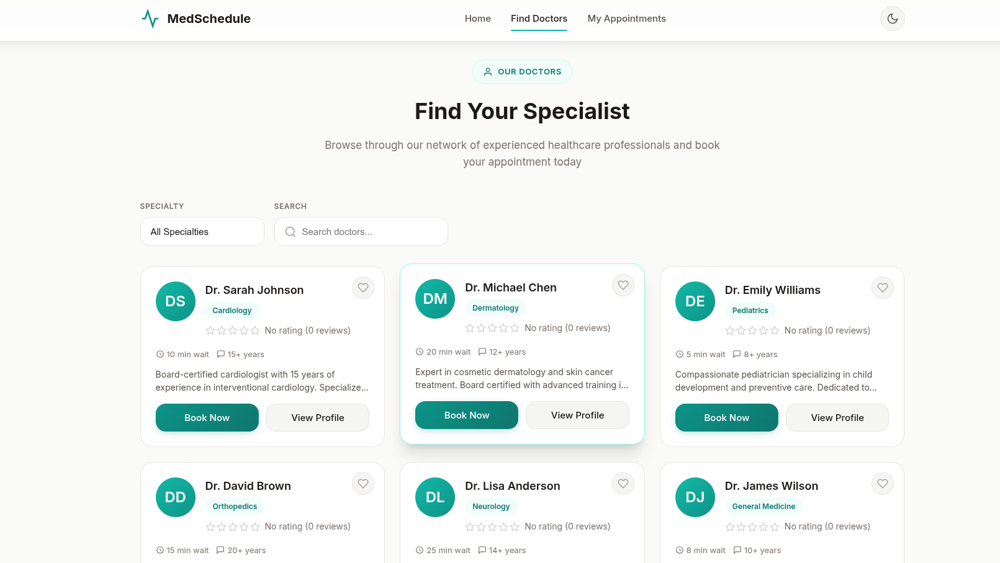
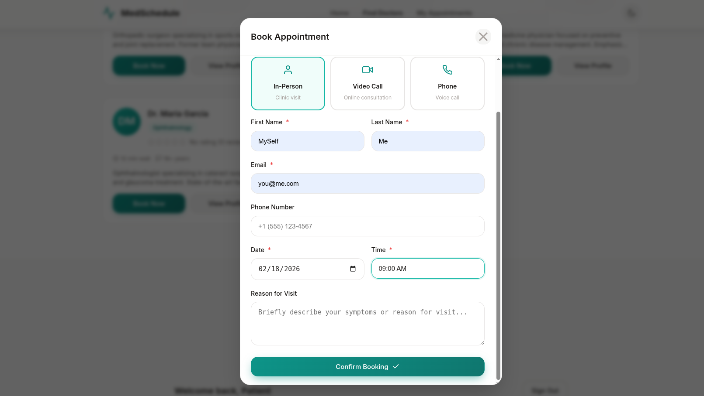
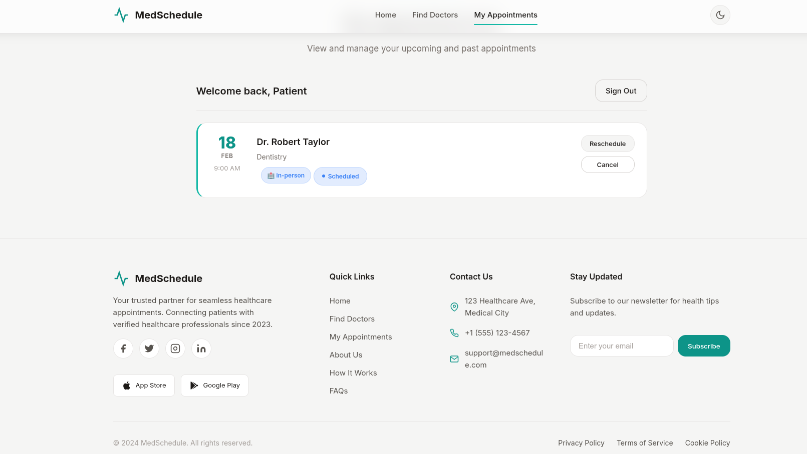

# MedSchedule

A modern, full-featured doctor appointment scheduling system with a premium user interface, built with Flask and SQLite.


---

## Table of Contents

- [Overview](#overview)
- [Features](#features)
- [Screenshots](#screenshots)
- [Tech Stack](#tech-stack)
- [Installation](#installation)
- [Configuration](#configuration)
- [Project Structure](#project-structure)
- [API Reference](#api-reference)
- [Admin Dashboard](#admin-dashboard)
- [License](#license)

---

## Overview

MedSchedule is a comprehensive healthcare appointment management solution that connects patients with healthcare providers. The platform offers an intuitive booking experience with features like doctor search, appointment scheduling, rescheduling, reviews, and an admin dashboard for clinic management.

---

## Features

### Core Functionality
- **Doctor Directory** - Browse doctors by specialty with detailed profiles
- **Smart Search** - Real-time autocomplete search for finding doctors
- **Appointment Booking** - Schedule appointments with date and time selection
- **Multiple Consultation Types** - Support for in-person, video call, and phone consultations
- **Appointment Management** - View, reschedule, or cancel upcoming appointments
- **Review System** - Rate and review doctors after completed appointments
- **Favorite Doctors** - Save preferred doctors for quick access

### Premium UI/UX
- **Glassmorphism Design** - Modern frosted glass effects with backdrop blur
- **Dark Mode** - Full dark theme support with localStorage persistence
- **Responsive Layout** - Optimized for desktop, tablet, and mobile devices
- **Micro-interactions** - Smooth animations, hover effects, and transitions
- **Loading States** - Skeleton loaders and spinners for all async operations
- **Form Validation** - Real-time inline validation with visual feedback

### Admin Features
- **Dashboard Statistics** - Overview of doctors, patients, and appointments
- **Doctor Management** - Add, edit, and remove doctors
- **Appointment Overview** - View and manage all appointments
- **Status Filtering** - Filter appointments by status

---

## Screenshots

### Home Page
The landing page showcases the platform's value proposition with quick access to doctor booking.


### Find Doctors
Browse through the network of healthcare professionals filtered by specialty.



### Booking Modal
A streamlined booking experience with consultation type selection and form validation.



### Appointments View
Manage upcoming and past appointments with reschedule and cancel options.



---

## Tech Stack

| Component | Technology |
|-----------|------------|
| Backend | Python Flask |
| ORM | Flask-SQLAlchemy |
| Database | SQLite |
| Frontend | Vanilla JavaScript, CSS3 |
| Styling | Custom CSS with CSS Variables |

---

## Installation

### Prerequisites
- Python 3.8 or higher
- pip (Python package manager)

### Setup

1. **Clone the repository**
   ```bash
   git clone https://github.com/ClaudiuJitea/MedSchedule.git
   cd MedSchedule
   ```

2. **Create a virtual environment** (recommended)
   ```bash
   python -m venv venv
   source venv/bin/activate  # On Windows: venv\Scripts\activate
   ```

3. **Install dependencies**
   ```bash
   pip install -r requirements.txt
   ```

4. **Run the application**
   ```bash
   python app.py
   ```

5. **Open your browser**
   Navigate to `http://localhost:5000`

The database will be automatically created with sample data on first run.

---

## Configuration

### Environment Variables

For production deployments, set the following environment variables:

| Variable | Description | Default |
|----------|-------------|---------|
| `SECRET_KEY` | Flask secret key for session management | `dev-secret-key-change-in-production` |
| `ADMIN_PASSWORD` | Password for admin dashboard access | `admin123` |

Example:
```bash
export SECRET_KEY="your-secure-random-string"
export ADMIN_PASSWORD="your-secure-admin-password"
```

---

## Project Structure

```
MedSchedule/
├── app.py                 # Flask application and API endpoints
├── requirements.txt       # Python dependencies
├── README.md              # Documentation
├── .gitignore             # Git ignore rules
├── img/                   # Screenshots and images
│   ├── hero_section.png
│   ├── find_doctors.png
│   ├── booking_modal.png
│   └── appointments_view.png
├── static/
│   ├── css/
│   │   └── style.css      # Application styles with dark mode
│   └── js/
│       └── app.js         # Frontend JavaScript logic
└── templates/
    ├── index.html         # Main application page
    ├── admin.html         # Admin dashboard
    └── 404.html           # Custom error page
```

---

## API Reference

### Public Endpoints

| Method | Endpoint | Description |
|--------|----------|-------------|
| GET | `/api/specialties` | List all medical specialties |
| GET | `/api/doctors` | List doctors (optional: `?specialty_id=`) |
| GET | `/api/doctors/<id>` | Get doctor details |
| GET | `/api/doctors/search?q=` | Search doctors by name |
| GET | `/api/doctors/<id>/availability` | Get doctor's weekly schedule |
| GET | `/api/doctors/<id>/reviews` | Get doctor's reviews |
| GET | `/api/available-slots` | Get available time slots |

### Patient Endpoints

| Method | Endpoint | Description |
|--------|----------|-------------|
| POST | `/api/appointments` | Create a new appointment |
| GET | `/api/appointments?email=` | Get patient's appointments |
| POST | `/api/appointments/<id>/reschedule` | Reschedule an appointment |
| POST | `/api/appointments/<id>/cancel` | Cancel an appointment |
| POST | `/api/reviews` | Submit a review |
| GET | `/api/favorites?email=` | Get favorite doctors |
| POST | `/api/favorites` | Toggle favorite status |

### Admin Endpoints

All admin endpoints require the `X-Admin-Password` header.

| Method | Endpoint | Description |
|--------|----------|-------------|
| GET | `/api/admin/stats` | Dashboard statistics |
| GET | `/api/admin/doctors` | List all doctors |
| POST | `/api/admin/doctors` | Add a new doctor |
| PUT | `/api/admin/doctors/<id>` | Update doctor information |
| DELETE | `/api/admin/doctors/<id>` | Delete a doctor |
| GET | `/api/admin/appointments` | List all appointments |
| DELETE | `/api/admin/appointments/<id>` | Delete an appointment |

---

## Admin Dashboard

Access the admin dashboard at `/admin`

**Default Credentials:**
- Password: `admin123` (change this in production via environment variable)

**Capabilities:**
- View platform statistics (doctors, patients, appointments)
- Manage doctor profiles (add, edit, delete)
- View and manage all appointments
- Filter appointments by status (scheduled, completed, cancelled)
- Mark appointments as complete or cancel them

---

## Sample Data

The application initializes with sample data including:

- **8 Medical Specialties**: Cardiology, Dermatology, Pediatrics, Orthopedics, Neurology, General Medicine, Ophthalmology, Dentistry
- **8 Sample Doctors**: Complete with bios, experience, and contact information
- **Default Availability**: Monday to Friday, 9:00 AM to 5:00 PM
- **Consultation Types**: Mix of in-person, video, and phone options

---

## Browser Support

- Chrome / Edge (latest)
- Firefox (latest)
- Safari (latest)
- Mobile browsers (iOS Safari, Chrome Android)

---

## License

MIT License

Copyright (c) 2024

Permission is hereby granted, free of charge, to any person obtaining a copy
of this software and associated documentation files (the "Software"), to deal
in the Software without restriction, including without limitation the rights
to use, copy, modify, merge, publish, distribute, sublicense, and/or sell
copies of the Software, and to permit persons to whom the Software is
furnished to do so, subject to the following conditions:

The above copyright notice and this permission notice shall be included in all
copies or substantial portions of the Software.

THE SOFTWARE IS PROVIDED "AS IS", WITHOUT WARRANTY OF ANY KIND, EXPRESS OR
IMPLIED, INCLUDING BUT NOT LIMITED TO THE WARRANTIES OF MERCHANTABILITY,
FITNESS FOR A PARTICULAR PURPOSE AND NONINFRINGEMENT. IN NO EVENT SHALL THE
AUTHORS OR COPYRIGHT HOLDERS BE LIABLE FOR ANY CLAIM, DAMAGES OR OTHER
LIABILITY, WHETHER IN AN ACTION OF CONTRACT, TORT OR OTHERWISE, ARISING FROM,
OUT OF OR IN CONNECTION WITH THE SOFTWARE OR THE USE OR OTHER DEALINGS IN THE
SOFTWARE.
